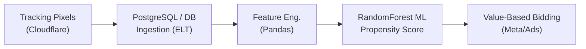

# AdTech ML & ROAS Prediction Pipeline

An end-to-end Data Engineering and Machine Learning pipeline designed to predict real-time visitor purchase intent and optimize Return On Ad Spend (ROAS) for e-commerce performance marketing.

## Data Pipeline Architecture

### Workflow
1. **Ingestion & Data Preparation**: Parsing user interaction logs (clicks, session activity, pageviews).
2. **Feature Engineering**: Transforming raw clickstream data into behavioral features (cart abandonment detection, engagement duration, visit recurrence).
3. **Machine Learning Model**: Training a `RandomForestClassifier` to output a real-time conversion probability score (`predict_proba`).
4. **Activation**: Enriching event payloads to drive **Value-Based Bidding** and maximize ROAS.

## Tech Stack
* **Language**: Python 3.12
* **Data Processing**: Pandas, NumPy, SQL (PostgreSQL / BigQuery)
* **Machine Learning**: Scikit-Learn (Random Forest Classifier)

## Getting Started

```bash
# Clone the repository
git clone https://github.com/votre-username/adtech-ml-roas-pipeline.git
cd adtech-ml-roas-pipeline

# Run the full pipeline
python roas_scoring_pipeline.py
